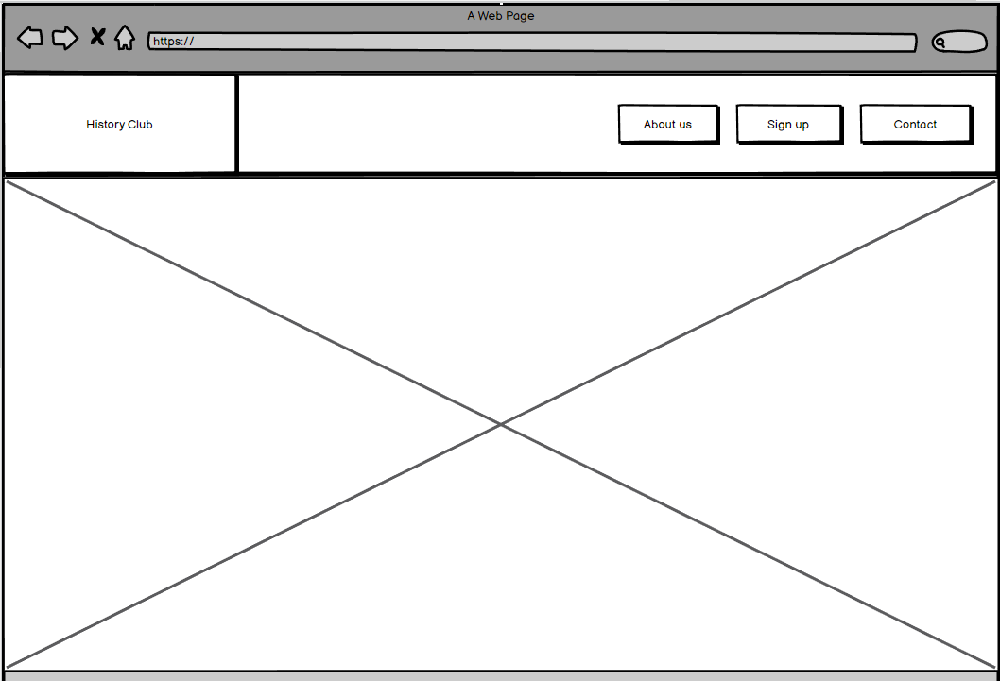

# History Club
The History Club is a website that aims to educate more people about the wonderful history of our world in the hopes of getting more people interested in History. The history club does this by functioning as a weekly newsletter that the site-visitors can sign up to where the reader can learn more about an historical event or person.

Live link to [The History Club](https://buster753.github.io/Project-1-CI/)

# Site owner goals
* To educate more people in the wonderful subject History
* To get more people interested in History
* To engage history hobbyists with fun history knowledge

# Design
For the design of this website alot insperation was taken from the Code Instute Love Running project. Mainly in the front page picture and in the structure of the about us section text.

The colors of this website was chosen by researching color combinations to find something that reminds the person of history in a calming way. The color combination was found on webflow blog page that can be found in the credits. The beige, black-brown and tan combination was chosen for its vintage victorian aesthetics and varmth. Whilst marketed for coffee brands and craft beer packaging the combination was chosen for its resemblence to older parchment together with a black-brown color to break of the main paige in the bottom of the page.

For the fonts a goal of presenting as calm, serious and easily read was created. To find fonts that fit this goal google fonts was used. Here I scrolled around until a fitting font was found. The fonts were then implemented in the css file.

The two pictures used were found using Pexels. A website offering free pictures for use. Here images portraying ancient historical buildings were used to help the website portray as a history website whilst simuntanisly captivating the reader.

# Wireframes

Intial project design using balsamiq wireframes

# Features

bilder på all delar
vad gör dessa delar?
varfor denna del?

# Testing

html och css validator

* Css <https://jigsaw.w3.org/css-validator/validator>
* html 
* html sign <https://validator.w3.org/nu/#textarea>
link pa resultat
accessibility lighhthouse

### Browser testing
The website was tested on Google chrome, Safari and Opera.

### Device testing
Device testing was done using responsinator and also using a personal iphone and ipad.
### Form testing
The forms were tested to make sure that all information was required.

# Technologies Used
* Html and CSS
* Balsamiq wireframes
* Google fonts
* Github
* Pexels
* W3c schools
* Fontawesome
* Responsinator
* Browser dev tools
* Codeaywhere
* Vscode

# Struggles and Bugs

### Codeanywhere malfunctions

During the duration of this project I had problems using codeanywhere. These problems consited mainly of not being able to save files and the browser not producing a preview using new code written. These problems were later solved by the help of tutoring support.
 
 
To combat these malfunctions most of this project was done in vscode and later copy-pasted into codeanywhere. This however effected git commits making them fewer resulting in them being less descriptive.

### Bugs

No bugs were found during development

# Deployment
Deployment of this website was done through github. To do this I entered the settings of this respository and changed the source on the Build and deployment tab to main and save.

# Credits

var hittades information etc

* Color Combination <https://webflow.com/blog/best-color-combinations>
* Fonts
* Images <https://www.pexels.com/sv-se/>

# Acknowledgements
Thank you to my mentor Antonio for your amazing help and advice when creating this project.